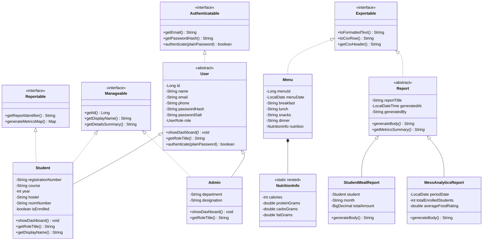

# 4. Class Diagram

This diagram visualizes the Object-Oriented inheritance hierarchy, interface implementations, and relationships.

```mermaid
classDiagram
    class Authenticatable {
        <<interface>>
        +getEmail() String
        +getPasswordHash() String
        +authenticate(plainPassword) boolean
    }

    class Manageable {
        <<interface>>
        +getId() Long
        +getDisplayName() String
        +getDetailsSummary() String
    }

    class Reportable {
        <<interface>>
        +getReportIdentifier() String
        +generateMetricsMap() Map
    }

    class Exportable {
        <<interface>>
        +toFormattedText() String
        +toCsvRow() String
        +getCsvHeader() String
    }

    class User {
        <<abstract>>
        -Long id
        -String name
        -String email
        -String phone
        -String passwordHash
        -String passwordSalt
        -UserRole role
        +showDashboard()* void
        +getRoleTitle()* String
        +authenticate(plainPassword) boolean
    }

    class Student {
        -String registrationNumber
        -String course
        -int year
        -String hostel
        -String roomNumber
        -boolean isEnrolled
        +showDashboard() void
        +getRoleTitle() String
        +getDisplayName() String
    }

    class Admin {
        -String department
        -String designation
        +showDashboard() void
        +getRoleTitle() String
    }

    class Menu {
        -Long menuId
        -LocalDate menuDate
        -String breakfast
        -String lunch
        -String snacks
        -String dinner
        -NutritionInfo nutrition
    }

    class NutritionInfo {
        <<static nested>>
        -int calories
        -double proteinGrams
        -double carbsGrams
        -double fatGrams
    }

    class Report {
        <<abstract>>
        -String reportTitle
        -LocalDateTime generatedAt
        -String generatedBy
        +generateBody()* String
        +getMetricsSummary()* String
    }

    class StudentMealReport {
        -Student student
        -String month
        -BigDecimal totalAmount
        +generateBody() String
    }

    class MessAnalyticsReport {
        -LocalDate periodDate
        -int totalEnrolledStudents
        -double averageFoodRating
        +generateBody() String
    }

    Authenticatable <|.. User
    User <|-- Student
    User <|-- Admin
    Manageable <|.. Student
    Reportable <|.. Student
    Manageable <|.. Admin
    Menu *-- NutritionInfo
    Exportable <|.. Menu
    Exportable <|.. Report
    Report <|-- StudentMealReport
    Report <|-- MessAnalyticsReport
```
