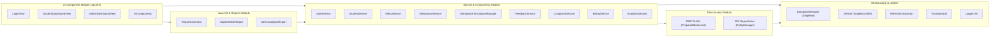

# 7. Component Diagram

This diagram visualizes the modular software components and dependencies in the FoodFlow architecture.

```mermaid
graph LR
    subgraph UI_Module ["UI Component Module (JavaFX)"]
        LoginView
        StudentDashboardView
        AdminDashboardView
        UIComponents
    end

    subgraph Core_Services ["Service & Concurrency Module"]
        AuthService
        StudentService
        MenuService
        AttendanceService
        AttendanceSimulationManager
        FeedbackService
        ComplaintService
        BillingService
        AnalyticsService
    end

    subgraph IO_Module ["Java I/O & Reports Module"]
        ReportGenerator
        StudentMealReport
        MessAnalyticsReport
    end

    subgraph Data_Access ["Data Access Module"]
        JDBC_DAOs["JDBC DAOs (PreparedStatement)"]
        JPA_Repos["JPA Repositories (EntityManager)"]
    end

    subgraph Infra_Module ["Infrastructure & Utilities"]
        DatabaseManager["DatabaseManager (Singleton)"]
        JPAUtil["JPAUtil (Singleton EMF)"]
        ReflectionInspector
        PasswordUtil
        LoggerUtil
    end

    UI_Module --> Core_Services
    UI_Module --> IO_Module
    Core_Services --> Data_Access
    Core_Services --> Infra_Module
    IO_Module --> Core_Services
    Data_Access --> Infra_Module
```
