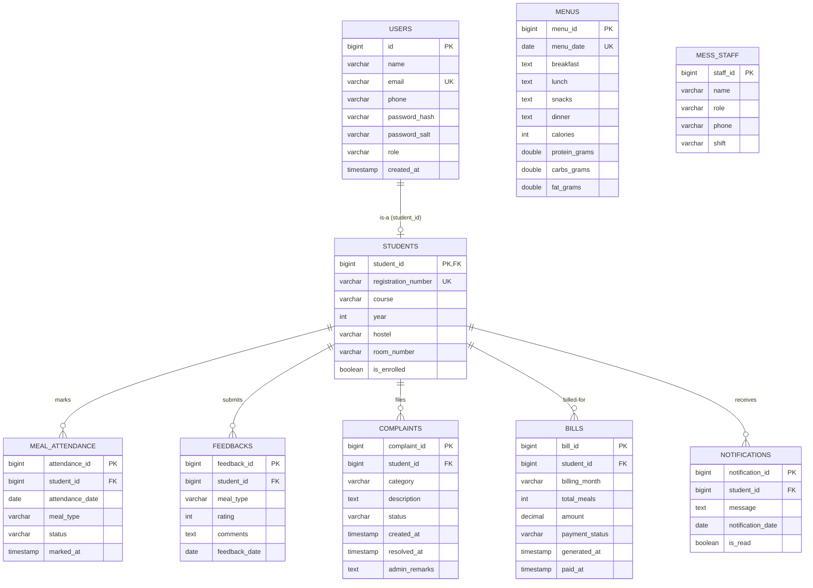

# 6. Entity-Relationship (ER) Diagram

This diagram visualizes the relational schema of `foodflow_db` with foreign keys and cardinality.

```mermaid
erDiagram
    USERS ||--o| STUDENTS : "is-a (student_id)"
    STUDENTS ||--o{ MEAL_ATTENDANCE : "marks"
    STUDENTS ||--o{ FEEDBACKS : "submits"
    STUDENTS ||--o{ COMPLAINTS : "files"
    STUDENTS ||--o{ BILLS : "billed-for"
    STUDENTS ||--o{ NOTIFICATIONS : "receives"

    USERS {
        bigint id PK
        varchar name
        varchar email UK
        varchar phone
        varchar password_hash
        varchar password_salt
        varchar role
        timestamp created_at
    }

    STUDENTS {
        bigint student_id PK,FK
        varchar registration_number UK
        varchar course
        int year
        varchar hostel
        varchar room_number
        boolean is_enrolled
    }

    MENUS {
        bigint menu_id PK
        date menu_date UK
        text breakfast
        text lunch
        text snacks
        text dinner
        int calories
        double protein_grams
        double carbs_grams
        double fat_grams
    }

    MEAL_ATTENDANCE {
        bigint attendance_id PK
        bigint student_id FK
        date attendance_date
        varchar meal_type
        varchar status
        timestamp marked_at
    }

    FEEDBACKS {
        bigint feedback_id PK
        bigint student_id FK
        varchar meal_type
        int rating
        text comments
        date feedback_date
    }

    COMPLAINTS {
        bigint complaint_id PK
        bigint student_id FK
        varchar category
        text description
        varchar status
        timestamp created_at
        timestamp resolved_at
        text admin_remarks
    }

    BILLS {
        bigint bill_id PK
        bigint student_id FK
        varchar billing_month
        int total_meals
        decimal amount
        varchar payment_status
        timestamp generated_at
        timestamp paid_at
    }

    NOTIFICATIONS {
        bigint notification_id PK
        bigint student_id FK
        text message
        date notification_date
        boolean is_read
    }

    MESS_STAFF {
        bigint staff_id PK
        varchar name
        varchar role
        varchar phone
        varchar shift
    }
```
