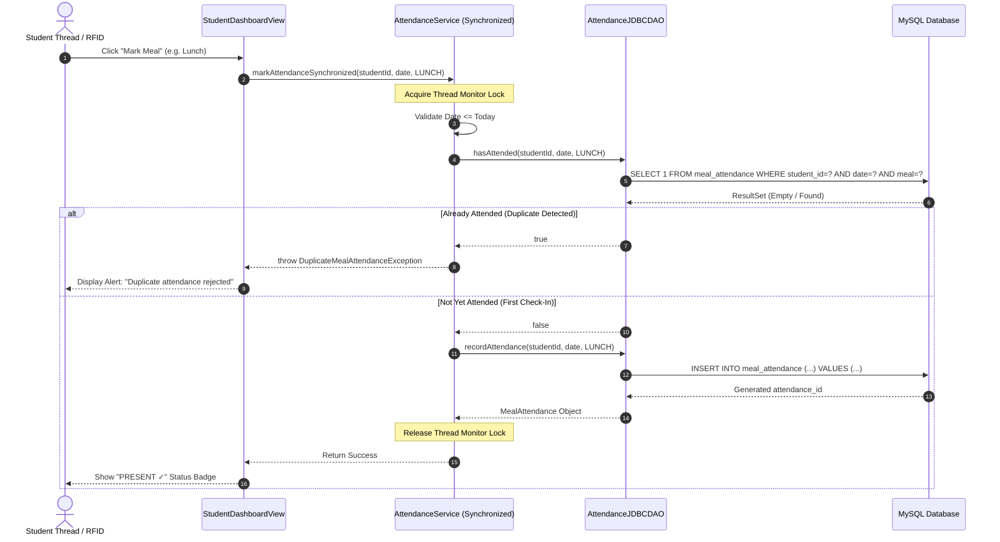

# 5. Sequence Diagram

This sequence diagram depicts the synchronized meal attendance marking transaction, demonstrating concurrency protection and exception handling.

```mermaid
sequenceDiagram
    autonumber
    actor Student as Student Thread / RFID
    participant UI as StudentDashboardView
    participant Svc as AttendanceService (Synchronized)
    participant DAO as AttendanceJDBCDAO
    participant DB as MySQL Database

    Student->>UI: Click "Mark Meal" (e.g. Lunch)
    UI->>Svc: markAttendanceSynchronized(studentId, date, LUNCH)
    Note over Svc: Acquire Thread Monitor Lock
    
    Svc->>Svc: Validate Date <= Today
    Svc->>DAO: hasAttended(studentId, date, LUNCH)
    DAO->>DB: SELECT 1 FROM meal_attendance WHERE student_id=? AND date=? AND meal=?
    DB-->>DAO: ResultSet (Empty / Found)
    
    alt Already Attended (Duplicate Detected)
        DAO-->>Svc: true
        Svc-->>UI: throw DuplicateMealAttendanceException
        UI-->>Student: Display Alert: "Duplicate attendance rejected"
    else Not Yet Attended (First Check-In)
        DAO-->>Svc: false
        Svc->>DAO: recordAttendance(studentId, date, LUNCH)
        DAO->>DB: INSERT INTO meal_attendance (...) VALUES (...)
        DB-->>DAO: Generated attendance_id
        DAO-->>Svc: MealAttendance Object
        Note over Svc: Release Thread Monitor Lock
        Svc-->>UI: Return Success
        UI-->>Student: Show "PRESENT ✓" Status Badge
    end
```
