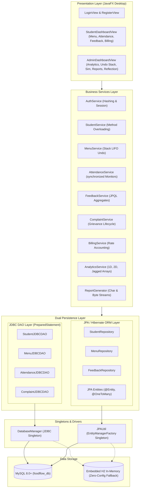

# 1. System Architecture Diagram

This diagram visualizes the multi-tier architectural layout of FoodFlow.

```mermaid
graph TD
    subgraph Presentation_Layer ["Presentation Layer (JavaFX Desktop)"]
        UI_Login["LoginView & RegisterView"]
        UI_Student["StudentDashboardView (Menu, Attendance, Feedback, Billing)"]
        UI_Admin["AdminDashboardView (Analytics, Undo Stack, Sim, Reports, Reflection)"]
    end

    subgraph Service_Layer ["Business Services Layer"]
        AuthSvc["AuthService (Hashing & Session)"]
        StudentSvc["StudentService (Method Overloading)"]
        MenuSvc["MenuService (Stack LIFO Undo)"]
        AttSvc["AttendanceService (synchronized Monitors)"]
        FeedbackSvc["FeedbackService (JPQL Aggregates)"]
        ComplaintSvc["ComplaintService (Grievance Lifecycle)"]
        BillingSvc["BillingService (Rate Accounting)"]
        AnalyticsSvc["AnalyticsService (1D, 2D, Jagged Arrays)"]
        ReportGen["ReportGenerator (Char & Byte Streams)"]
    end

    subgraph Persistence_Layer ["Dual Persistence Layer"]
        subgraph JDBC_DAOs ["JDBC DAO Layer (PreparedStatement)"]
            StudentDAO["StudentJDBCDAO"]
            MenuDAO["MenuJDBCDAO"]
            AttDAO["AttendanceJDBCDAO"]
            ComplaintDAO["ComplaintJDBCDAO"]
        end
        subgraph JPA_ORM ["JPA / Hibernate ORM Layer"]
            StudentRepo["StudentRepository"]
            MenuRepo["MenuRepository"]
            FeedbackRepo["FeedbackRepository"]
            JPAEntities["JPA Entities (@Entity, @OneToMany)"]
        end
    end

    subgraph Resource_Layer ["Singletons & Drivers"]
        DBMgr["DatabaseManager (JDBC Singleton)"]
        JPAUtilEMF["JPAUtil (EntityManagerFactory Singleton)"]
    end

    subgraph Storage_Layer ["Data Storage"]
        MySQL[("MySQL 8.0+ (foodflow_db)")]
        H2Mem[("Embedded H2 In-Memory (Zero-Config Fallback)")]
    end

    Presentation_Layer --> Service_Layer
    Service_Layer --> Persistence_Layer
    JDBC_DAOs --> DBMgr
    JPA_ORM --> JPAUtilEMF
    DBMgr --> MySQL
    DBMgr -.-> H2Mem
    JPAUtilEMF --> MySQL
    JPAUtilEMF -.-> H2Mem
```
