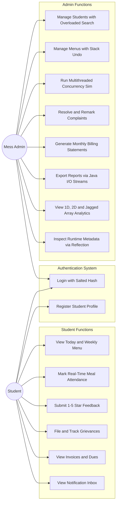

# 3. Use Case Diagram

This diagram specifies the core user interactions available to Students and Mess Administrators.

```mermaid
flowchart LR
    Student((Student))
    Admin((Mess Admin))

    subgraph Authentication ["Authentication System"]
        UC1[Login with Salted Hash]
        UC2[Register Student Profile]
    end

    subgraph Student_Actions ["Student Functions"]
        UC3[View Today and Weekly Menu]
        UC4[Mark Real-Time Meal Attendance]
        UC5[Submit 1-5 Star Feedback]
        UC6[File and Track Grievances]
        UC7[View Invoices and Dues]
        UC8[View Notification Inbox]
    end

    subgraph Admin_Actions ["Admin Functions"]
        UC9[Manage Students with Overloaded Search]
        UC10[Manage Menus with Stack Undo]
        UC11[Run Multithreaded Concurrency Sim]
        UC12[Resolve and Remark Complaints]
        UC13[Generate Monthly Billing Statements]
        UC14[Export Reports via Java I/O Streams]
        UC15[View 1D, 2D and Jagged Array Analytics]
        UC16[Inspect Runtime Metadata via Reflection]
    end

    Student --> UC1
    Student --> UC2
    Student --> UC3
    Student --> UC4
    Student --> UC5
    Student --> UC6
    Student --> UC7
    Student --> UC8

    Admin --> UC1
    Admin --> UC9
    Admin --> UC10
    Admin --> UC11
    Admin --> UC12
    Admin --> UC13
    Admin --> UC14
    Admin --> UC15
    Admin --> UC16
```
