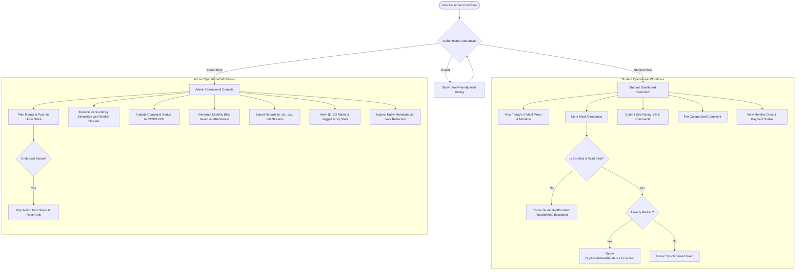

# 2. Workflow Diagram

This diagram depicts the end-to-end operational flow from user authentication to daily mess attendance, feedback, grievance filing, and monthly invoice settlement.

```mermaid
flowchart TD
    Start([User Launches FoodFlow]) --> Login{Authenticate Credentials}
    
    Login -- Invalid --> ErrorMsg[Show User-Friendly Alert Dialog] --> Login
    
    Login -- Student Role --> StudentHub[Student Dashboard Overview]
    Login -- Admin Role --> AdminHub[Admin Operational Console]
    
    subgraph Student_Workflow ["Student Operational Workflows"]
        StudentHub --> ViewMenu[View Today's 4-Meal Menu & Nutrition]
        StudentHub --> MarkMeal[Mark Meal Attendance]
        MarkMeal --> CheckEnrollment{Is Enrolled & Valid Date?}
        CheckEnrollment -- No --> RejectAtt[Throw StudentNotEnrolled / InvalidMeal Exception]
        CheckEnrollment -- Yes --> CheckDup{Already Marked?}
        CheckDup -- Yes --> RejectDup[Throw DuplicateMealAttendanceException]
        CheckDup -- No --> RecordAtt[Atomic Synchronized Insert]
        
        StudentHub --> GiveReview[Submit Star Rating 1-5 & Comments]
        StudentHub --> FileGrievance[File Categorized Complaint]
        StudentHub --> CheckBills[View Monthly Dues & Payment Status]
    end
    
    subgraph Admin_Workflow ["Admin Operational Workflows"]
        AdminHub --> MenuManage[Plan Menus & Push to Undo Stack]
        MenuManage --> UndoOp{Undo Last Action?}
        UndoOp -- Yes --> PopStack[Pop Action from Stack & Revert DB]
        
        AdminHub --> RunSim[Execute Concurrency Simulation with Worker Threads]
        AdminHub --> ResolveGrievances[Update Complaint Status to RESOLVED]
        AdminHub --> GenInvoices[Generate Monthly Bills based on Attendance]
        AdminHub --> ExportReports[Export Reports to .txt, .csv, .dat Streams]
        AdminHub --> ViewArrays[View 1D, 2D Matrix & Jagged Array Stats]
        AdminHub --> ClassInspect[Inspect Entity Metadata via Java Reflection]
    end
```
